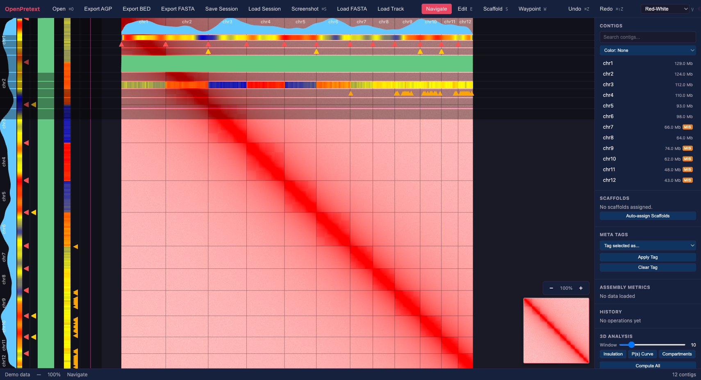
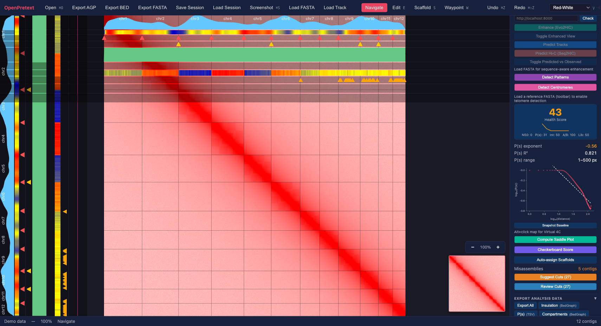
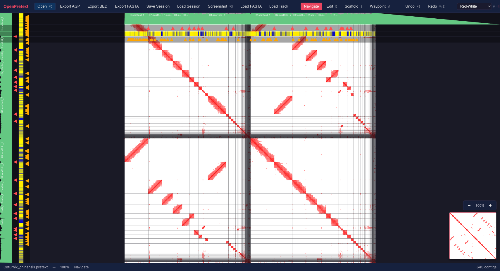
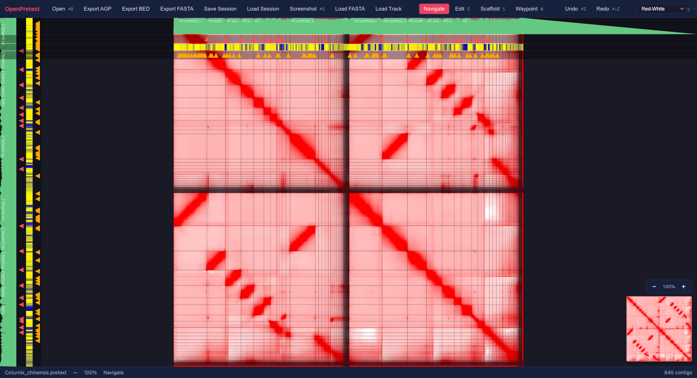

# OpenPretext

A modern, web-based Hi-C contact map viewer and genome assembly curation tool.

**[Try it now at shandley.github.io/openpretext](https://shandley.github.io/openpretext/)** — no installation required. Click **Load Example** to explore a real koala genome assembly.

OpenPretext is designed as a browser-based alternative to
[PretextView](https://github.com/sanger-tol/PretextView), the Wellcome Sanger
Institute's desktop application used by genome assembly teams worldwide
(Darwin Tree of Life, Vertebrate Genomes Project, Earth BioGenome Project).
It reads native `.pretext` files directly in the browser with no installation
required.


*Contact map with contig sidebar, misassembly badges, annotation tracks, and analysis overlays*


*Evo2HiC ML integration, centromere detection, health score, P(s) decay chart, checkerboard score, and misassembly tools*

## Features

### Rendering

- WebGL2-accelerated contact map display at 60fps
- Tile-based level-of-detail rendering with LRU cache and background decompression
- Six color maps (Red-White, Blue-White-Red, Viridis, Hot, Cool, Grayscale) with keyboard cycling
- Adjustable gamma correction (0.1 to 2.0) via slider or keyboard
- Contig grid overlay with anti-aliased boundary lines
- Contig labels along map edges
- Minimap overview with click-to-navigate viewport indicator
- Scaffold color bands showing chromosome assignments
- Waypoint position markers
- Annotation track overlays (line, heatmap, marker modes)
- Comparison mode overlay showing original vs curated assembly boundaries

### Curation

- Cut, join, invert, and move contigs with full undo/redo
- Drag-and-drop contig reordering in sidebar and on map
- Selection system: click, shift-range, ctrl-toggle, select-all
- Contig exclusion (mark contigs to hide from exports without deleting)
- Scaffold painting mode for chromosome assignment (create, rename, delete, paint, unpaint)
- Waypoint markers for positions of interest with keyboard navigation
- Batch operations: select by name pattern or size range, batch cut/join/invert, sort by length
- Contig meta tags: classify contigs as haplotig, contaminant, unlocalised, or sex chromosome with colored sidebar badges

### Automated Curation Algorithms

- **Auto Sort (Union Find)** — Scores all contig pairs using Hi-C inter-contig
  link analysis across 4 orientations, then chains contigs into chromosome groups
  using a greedy Union Find algorithm. Automatically applies inversions and
  reordering via the command palette.
- **Auto Cut (Breakpoint Detection)** — Analyzes diagonal Hi-C signal density to
  detect misassembly breakpoints where the contact signal drops, automatically
  splitting contigs at discontinuities.

### AI-Powered Curation Assistant

- Vision-based contact map analysis using the Anthropic Messages API (Claude)
- Captures a screenshot of the current map state, builds assembly context from
  contig ordering, metrics, and scaffold assignments, and sends it for analysis
- Returns executable DSL command suggestions with one-click "Run" buttons
- Prompt strategy system with 8 built-in strategies:
  - **General Analysis** — balanced, suitable for any assembly
  - **Inversion Detection** — specialized for anti-diagonal inversion patterns
  - **Scaffold Assignment** — guides chromosome-level organization
  - **Fragmented Assembly** — optimized for many-contig assemblies, emphasizes autosort/autocut
  - **Micro-chromosomes** — for bird and reptile genomes with micro-chromosomes
  - **Analysis-Guided Curation** — uses computed analysis tracks and health score to guide decisions
  - **Haplotig Detection** — identifies haplotigs in dual-haplotype or partially phased assemblies
  - **Telomere-Aware Curation** — uses telomere detection to assess chromosome completeness
- Custom strategy editor: create, edit, and delete your own strategies with
  supplementary prompt text and few-shot examples
- Strategy export/import as JSON files for sharing between users
- Browse community strategies from the
  [openpretext-strategies](https://github.com/shandley/openpretext-strategies)
  repository directly from the AI panel
- Per-suggestion feedback (thumbs up/down) with aggregate strategy ratings

### 3D Genomics Analysis

- **Insulation score + TAD boundaries** — sliding off-diagonal window (Crane et al. 2015) computes
  insulation profile and detects topologically associating domain boundaries as prominent local minima
- **P(s) contact decay curve** — intra-chromosomal contact frequency vs genomic distance with
  power-law exponent fitting in log-log space; inline SVG chart with comparative baseline overlay
- **Per-chromosome P(s)** — scaffold-aware decay curves computed independently per chromosome
- **A/B compartments** — observed/expected normalization, correlation matrix, first eigenvector
  via power iteration; rendered as a heatmap track
- **ICE normalization** — Sinkhorn-Knopp iterative matrix balancing for bias correction; computes
  per-bin bias vector and normalized contact matrix with low-coverage bins masked by quantile filtering
- **Directionality index** — Dixon et al. 2012 signed chi-square directionality scores with
  configurable window size; detects TAD boundaries at sign-change zero crossings
- **Hi-C library quality** — cis/trans contact ratio, short/long range ratio, contact density,
  and per-contig cis ratios; integrates into the 5-component assembly health score
- **Saddle plot** — compartment strength visualization showing O/E enrichment by eigenvector
  quantile; inline SVG heatmap with strength metric
- **Virtual 4C** — interactive locus contact profiling from any viewpoint bin via Alt+click;
  distance-expected normalization with optional log2 transform
- **KR normalization** — Knight-Ruiz iterative matrix balancing (Knight & Ruiz 2013); faster
  convergence than ICE; produces "KR Bias" line track and re-runs downstream analysis on the
  normalized matrix
- **Telomere repeat detection** — scans loaded FASTA sequences for TTAGGG/CCCTAA repeat motifs
  at contig ends; computes genome-wide density profiles and identifies telomere-positive ends;
  requires loading a reference FASTA first
- **Checkerboard score** — information-entropy-based compartment regularity metric
  (Che et al. 2025, HiArch); quantifies how strongly a genome exhibits the alternating
  A/B compartment "checkerboard" pattern; includes species reference comparison against
  1,025 species showing nearest landmark, taxonomic group, and percentile
- **Centromere detection** — predicts centromere positions from inter-chromosomal contact
  hubs using the CenterFinder algorithm (Che et al. 2025); blends inter-contig row sums
  with anti-diagonal Rabl folding signal; produces "Centromere Signal" line track and
  "Centromeres" marker track
- **Composite health score** — 0-100 score combining contiguity (N50), P(s) decay quality,
  assembly integrity, compartment strength (eigenvalue + checkerboard), and Hi-C library
  quality; displayed as a prominent card in the sidebar
- All analyses run in a background Web Worker to avoid blocking the UI
- Adjustable insulation window size; auto-computation on file load
- BedGraph and TSV export for all analysis tracks

### ML-Powered Hi-C Enhancement and Prediction

Integrates [Evo2HiC](https://github.com/CHNFTQ/Evo2HiC) foundation models via an optional
companion server (`server/`). The core app works fully without it.

- **Resolution enhancement** — Evo2HiC (81M parameters, trained on 177 species) enhances
  low-resolution Hi-C overview maps, revealing chromosome territory boundaries,
  inter-chromosomal contacts, and distance-decay patterns below the raw data's noise floor
- **Epigenomic track prediction** — predicts 5 epigenomic tracks (DNase, CTCF, H3K27ac,
  H3K27me3, H3K4me3) from the Hi-C contact map using the CDNAtrack model, providing
  predicted chromatin marks for non-model organisms where no ChIP-seq data exists
- **Seq2HiC prediction** — predicts a Hi-C contact map from DNA sequence alone using the
  Seq2HiC model, enabling comparison between observed and sequence-predicted contact patterns
- Toggle between original, enhanced, and predicted views in real time
- Enhanced/predicted maps feed into downstream analysis (insulation, compartments, P(s) decay)
- All ML outputs cleared automatically on curation operations (contig ordering changed)
- Session persistence for enhanced maps and predicted tracks


*Original Hi-C overview of King quail (Coturnix chinensis) — 645 contigs, 30 chromosomes*


*Same genome after Evo2HiC enhancement — inter-chromosomal contacts, distance-decay gradients, and inter-haplotype signal now visible*

### Misassembly Detection and Curation

- Automatic detection of potential chimeric contigs using TAD boundary and compartment
  switch signals that fall inside (not at edges of) contigs
- Misassembly flags shown as orange "MIS" badges in the contig sidebar
- **Cut suggestions** with composite confidence scoring (TAD 50% + compartment 30% + decay 20%)
  shown as sorted cards with colored badges (green/yellow/red)
- **Cut review panel** — step-by-step guided walkthrough of each cut suggestion with
  camera navigation, accept/skip/back controls
- **Pattern detection** — algorithmic inversion (anti-diagonal butterfly) and translocation
  (off-diagonal enrichment) detection with clickable result cards and "Go" navigation
- **Scaffold auto-detection** — detects chromosome block boundaries from the block-diagonal
  structure of the contact map and assigns scaffolds automatically

### Curation Progress Tracking

- Real-time ordering quality feedback using Kendall tau rank correlation vs reference
- Longest correct contiguous run counter
- Trend arrows (improving/declining/neutral) after each curation operation
- Resettable reference ordering baseline

### Annotation Tracks

- Coverage, telomere, gap, and GC content tracks from embedded `.pretext` graph extensions
- Telomere density track from loaded reference FASTA sequences
- BedGraph file upload with automatic contig coordinate mapping
- Per-track configuration: color picker, rendering mode (line/heatmap/marker), visibility toggle
- Track management panel in sidebar

### Export and Import

- **AGP 2.1** export (scaffold-aware assembly structure)
- **BED6** export (scaffold-aware genomic intervals)
- **FASTA** export with reverse complement for inverted contigs
- **PNG** screenshot export
- **BedGraph/TSV** export of all analysis tracks (insulation, P(s), compartments,
  directionality, ICE bias, KR bias, quality metrics, saddle plot)
- **Session save/load** (JSON with full undo/redo stack + analysis data)
- **Curation log** export (JSON operation history)
- **Strategy JSON** export/import for AI prompt strategies
- Reference FASTA loading for curated sequence export
- BedGraph track file loading

### Assembly Quality Metrics

- N50/L50, N90/L90, total length, contig count, longest/shortest/mean/median contig
- Live stats panel in the sidebar with delta tracking after each operation
- Automatic metric snapshots on file load and after every curation operation
- Scaffold count and operation counter

### Scripting

- 18-command curation DSL covering all operations (cut, join, invert, move,
  select, deselect, scaffold create/paint/unpaint/delete, zoom, goto, autocut,
  autosort, echo)
- Contig references by name or by index (`#0`, `#15`)
- Script console with syntax highlighting and output panel
- Replay curation sessions from operation logs via the "From Log" button
- All UI curation operations have script equivalents

### Tutorial System

- 10 interactive lessons covering the full curation workflow:
  1. Reading the Contact Map
  2. Understanding Chromosomes
  3. Detecting Misassembly
  4. Cutting and Joining
  5. Scaffold Assignment
  6. Full Curation Exercise
  7. 3D Genomics Analysis
  8. Classifying Contigs with Meta Tags
  9. Automated Misassembly Detection
  10. ML-Powered Enhancement (Evo2HiC)
- Step-based progression with instructions, hints, and UI element highlighting
- Auto-advance when the expected user action is detected
- Assessment scoring using Kendall tau similarity against ground-truth orderings
- Difficulty levels: beginner, intermediate, advanced

### Education and Example Datasets

- **10 curated specimen datasets** from GenomeArk spanning mammals, birds, reptiles,
  fish, amphibians, and invertebrates, loadable from the welcome screen:
  - Koala, Bluehead Wrasse, King Quail, Zebra Finch, Nile Crocodile, Spinyfin,
    Wait's Blind Snake, Couch's Spadefoot Toad, European Lancelet, Great Fruit-eating Bat
- **Hi-C pattern gallery** with 11 reference patterns (strong diagonal, chromosome
  blocks, inversions, translocations, micro-chromosomes, low coverage, unplaced
  contigs, A/B compartments) with visual descriptions and click-to-navigate
- Each specimen includes metadata: species name, genome size, chromosome count,
  contig count, difficulty level, and characteristic Hi-C patterns

### UI and Navigation

- Four interaction modes: Navigate, Edit, Scaffold, Waypoint
- Command palette (Cmd+K / Ctrl+K) with fuzzy search across all commands
- Keyboard shortcuts for all operations (press `?` for reference)
- Pan via mouse drag, zoom via scroll wheel or trackpad pinch (0.5x to 200x)
- Zoom controls (+/- buttons) with zoom level indicator
- Touch and trackpad gesture support (pinch-zoom, two-finger pan)
- Jump to diagonal, reset view, zoom to specific contigs
- Responsive layout with mobile and tablet breakpoints
- Searchable contig list with scaffold badges, meta tag badges, exclusion indicators, and inversion markers
- Sidebar panels: contigs, scaffolds, assembly metrics, history, 3D analysis, curation progress, tracks
- Lesson browser modal for browsing and starting tutorial lessons
- Workflow guide modal with 7-step recommended curation workflow
- Edit mode hint overlay for new users
- Toast notifications, detailed hover tooltips, loading progress overlay
- Drag-and-drop file opening

### Benchmark System

- CLI-based benchmark pipeline for automated curation algorithm evaluation
- Specimen download tools for acquiring test data from GenomeArk
- Metrics: breakpoint detection F1 score, Kendall tau ordering accuracy, orientation accuracy
- Parameter sweep for tuning AutoSort and AutoCut thresholds
- Regression testing against stored baselines (`bench/baselines.json`)
- Ordering metrics shared between browser assessment and CLI benchmarks
  (kendallTau, adjustedRandIndex, longestCorrectRun)

## Getting Started

### Prerequisites

- [Node.js](https://nodejs.org/) 18 or later

### Install and Run

```bash
git clone https://github.com/shandley/openpretext.git
cd openpretext
npm install
npm run dev
```

Open http://localhost:3000 in a browser, then either:
- Click **Load Example** to download and explore a real genome assembly
- Click **Open** to load a `.pretext` file from your computer
- Drag and drop a `.pretext` file onto the window
- Click **Start Tutorial** for a guided walkthrough

### Running Locally

OpenPretext requires a local HTTP server; the `file://` protocol will not work
due to CORS restrictions and ES module loading requirements.

```bash
npm run dev          # Development server with hot reload (http://localhost:3000)
npm run build        # Build for production
npm run preview      # Preview the production build locally
```

If you just want to preview a production build without cloning, `npx vite preview`
works from the project root after `npm run build`.

### Obtaining Test Data

Real `.pretext` files are available from the
[GenomeArk](https://www.genomeark.org/) public S3 bucket. For example, to
download a zebra finch contact map (~56 MB):

```bash
aws s3 cp \
  s3://genomeark/species/Taeniopygia_guttata/bTaeGut2/assembly_curated/evaluation/pretext/bTaeGut2.mat.pretext \
  . --no-sign-request
```

The `--no-sign-request` flag allows access without AWS credentials.

## Keyboard Shortcuts

Press `?` at any time to open the shortcuts reference.

| Key | Action |
|-----|--------|
| `E` | Edit mode (cut/join/invert/move) |
| `S` | Scaffold painting mode |
| `W` | Waypoint mode |
| `N` / `Esc` | Navigate mode |
| `C` | Cut contig at cursor (edit mode) |
| `J` | Join selected contigs (edit mode) / Jump to diagonal |
| `F` | Flip/invert selected (edit mode) |
| `H` | Toggle contig exclusion (edit mode) |
| `P` | Toggle comparison mode |
| `L` | Toggle contig grid |
| `I` | Toggle info sidebar |
| `X` | Toggle annotation tracks |
| `M` | Toggle minimap |
| `?` | Keyboard shortcuts reference |
| `` ` `` | Script console |
| `]` / `.` | Next waypoint |
| `[` / `,` | Previous waypoint |
| `Up/Down` | Cycle color maps |
| `Left/Right` | Adjust gamma |
| `Home` | Reset view |
| `Delete` | Clear all waypoints |
| `Cmd+K` | Command palette |
| `Cmd+Z` | Undo |
| `Cmd+Shift+Z` | Redo |
| `Cmd+O` | Open file |
| `Cmd+S` | Screenshot |
| `+` / `=` | Zoom in |
| `-` | Zoom out |
| `Cmd+A` | Select all contigs (edit mode) |

## Curation Workflow

### Manual Curation

1. Load a `.pretext` file
2. Press `E` to enter edit mode
3. Select contigs by clicking (shift-click for range, ctrl-click to toggle)
4. Use cut (`C`), join (`J`), invert (`F`), and drag to reorder the assembly
5. Press `H` to exclude contigs from export
6. Press `S` to enter scaffold mode and paint contigs into chromosomes
7. Export the curated assembly as AGP, BED, or FASTA via the toolbar
8. Toggle comparison mode (`P`) to see original vs curated boundaries

### Automated Curation

Open the command palette (`Cmd+K`) and run:
- **Auto cut: detect breakpoints** — Scans all contigs for misassembly
  breakpoints by analyzing the diagonal Hi-C signal. Contigs are split wherever
  the signal drops significantly. Each cut is a separate undo step.
- **Auto sort: Union Find** — Scores every contig pair across 4 orientations
  (head-head, head-tail, tail-head, tail-tail), then greedily chains contigs
  into chromosome groups. The algorithm applies inversions where needed and
  reorders the assembly. Each operation is individually undoable.

A typical automated workflow: run Auto Cut first to break misassemblies, then
Auto Sort to group and orient the fragments into chromosomes.

All operations support undo (`Cmd+Z`) and redo (`Cmd+Shift+Z`).

### AI-Assisted Curation

1. Open the AI Assist panel from the toolbar
2. Enter your Anthropic API key (stored locally, never sent to any server except Anthropic)
3. Select a prompt strategy from the dropdown (or create a custom one)
4. Click **Analyze Map** to send a screenshot and assembly context to Claude
5. Review the suggestions and click **Run** to execute any DSL command block
6. Use thumbs up/down to rate suggestions and improve strategy selection

Browse community-contributed strategies at
[openpretext-strategies](https://github.com/shandley/openpretext-strategies)
or share your own via the Export button.

## Scripting

Open the script console with the backtick key or the **Console** button.
Commands can be typed directly or generated from the curation log using the
**From Log** button. Run scripts with Ctrl+Enter.

Example script:

```
# Invert a misoriented contig
invert chr3

# Move a contig to a new position
move #5 to 0

# Cut a contig at a pixel offset
cut chr1 500

# Join two adjacent contigs
join chr1_L chr1_R

# Assign contigs to a scaffold
scaffold create Chromosome_1
scaffold paint #0 Chromosome_1
scaffold paint #1 Chromosome_1

# Select and deselect
select chr2
deselect all

# Navigate
zoom chr5
goto 0.25 0.25

# Automated operations
autosort
autocut

# Print a message
echo Curation complete
```

See the full DSL reference by typing `help` in the script console.

## File Format Support

- **`.pretext`** -- native BC4-compressed contact maps produced by
  [PretextMap](https://github.com/sanger-tol/PretextMap), including embedded
  graph extensions from
  [PretextGraph](https://github.com/sanger-tol/PretextGraph)
- **`.bedgraph`** -- annotation tracks loaded via the **Load Track** button
- **`.fasta`** -- reference sequences loaded via **Load FASTA** for curated export

For technical details on the binary format, see
[docs/PRETEXT_FORMAT.md](docs/PRETEXT_FORMAT.md).

## Development

```bash
npm run dev          # Start development server with hot reload
npm test             # Run unit tests (2,258 tests across 84 files)
npm run test:visual  # Run E2E tests (35 tests, Playwright + Chromium)
npm run build        # Production build to dist/
npm run preview      # Preview the production build
```

### Benchmarks

```bash
npm run bench:acquire      # Download test specimens from GenomeArk
npm run bench:run          # Execute benchmarks
npm run bench:sweep        # Sweep parameter ranges
npm run bench:regression   # Compare against stored baselines
```

### Project Structure

```
src/
  main.ts                    Application entry point and orchestrator
  core/
    State.ts                 Application state with undo/redo
    EventBus.ts              Typed event emitter
    DerivedState.ts          Computed state selectors
  formats/
    PretextParser.ts         .pretext binary format parser (BC4/deflate)
    SyntheticData.ts         Demo contact map generator
    SyntheticTracks.ts       Demo annotation track generator
    FASTAParser.ts           FASTA sequence parser
    BedGraphParser.ts        BedGraph annotation track parser
  renderer/
    WebGLRenderer.ts         WebGL2 contact map renderer
    Camera.ts                Pan/zoom camera with mouse/touch/trackpad
    TileManager.ts           Tile-based LOD with LRU cache
    TileDecoder.ts           Background tile decompression worker
    ColorMaps.ts             Color map implementations (6 maps)
    LabelRenderer.ts         Contig label overlay
    Minimap.ts               Overview minimap with viewport indicator
    TrackRenderer.ts         Annotation track renderer (line/heatmap/marker)
    ScaffoldOverlay.ts       Scaffold color band overlay
    WaypointOverlay.ts       Waypoint marker overlay
    ContactMapReorder.ts     Contact map pixel reordering after curation
  curation/
    CurationEngine.ts        Cut/join/invert/move with undo/redo
    SelectionManager.ts      Contig selection (click/shift/ctrl)
    DragReorder.ts           Visual drag reordering
    ScaffoldManager.ts       Scaffold (chromosome) assignment CRUD
    WaypointManager.ts       Named position markers
    ContigExclusion.ts       Contig hide/exclude management
    MisassemblyFlags.ts      Singleton manager for flagged contigs
    MetaTagManager.ts        Contig classification meta tags
    AutoCut.ts               Diagonal signal breakpoint detection
    AutoSort.ts              Union Find link scoring and chaining
    BatchOperations.ts       Batch select/cut/join/invert/sort
    QualityMetrics.ts        N50/L50/N90/L90 assembly statistics
    OrderingMetrics.ts       Shared ordering metrics (kendallTau, ARI)
  ai/
    AIClient.ts              Anthropic Messages API wrapper (vision)
    AIContext.ts             Assembly state context builder for AI prompts
    AIPrompts.ts             System prompt with DSL reference + Hi-C guide
    AIFeedback.ts            Per-suggestion feedback storage + aggregation
    AIStrategyIO.ts          Strategy export/import as JSON files
  data/
    SpecimenCatalog.ts       Types + loader for specimen-catalog.json
    LessonSchema.ts          Types + loader for tutorial lesson JSON files
    PromptStrategy.ts        Types + loader + custom strategy CRUD
  scripting/
    ScriptParser.ts          Tokenizer + parser for 18-command DSL
    ScriptExecutor.ts        Executes parsed AST via ScriptContext DI
    ScriptReplay.ts          Converts operation logs to DSL scripts
  analysis/
    InsulationScore.ts       Insulation score + TAD boundary detection
    ContactDecay.ts          P(s) contact decay curve + exponent fitting
    CompartmentAnalysis.ts   A/B compartment eigenvector (O/E + PCA)
    ICENormalization.ts      ICE (Sinkhorn-Knopp) matrix balancing
    KRNormalization.ts       Knight-Ruiz matrix balancing
    DirectionalityIndex.ts   Directionality index + TAD boundaries
    HiCQualityMetrics.ts     Library-level quality metrics
    SaddlePlot.ts            Compartment strength visualization
    Virtual4C.ts             Interactive locus contact profiling
    TelomereDetector.ts      Telomere repeat detection from FASTA
    MisassemblyDetector.ts   Chimeric contig detection + confidence scoring
    CheckerboardScore.ts     Entropy-based compartment regularity (Che et al. 2025)
    CentromereDetector.ts    Centromere prediction from inter-contig contact hubs
    HealthScore.ts           Composite assembly quality score (0-100)
    ScaffoldDetection.ts     Auto-detect chromosome blocks from contact map
    PatternDetector.ts       Inversion + translocation detection
    CurationProgress.ts      Real-time ordering progress scoring
    AnalysisWorker.ts        Background Web Worker for analysis
    AnalysisWorkerClient.ts  Promise-based main-thread worker client
    Evo2HiCClient.ts          HTTP client for Evo2HiC server (enhance/predict/seq2hic)
    Evo2HiCEnhancement.ts     Contact map encode/decode/downscale + track utilities
  export/
    AGPWriter.ts             AGP 2.1 format generation
    BEDWriter.ts             BED6 format export (scaffold-aware)
    FASTAWriter.ts           FASTA export with reverse complement
    AnalysisExport.ts        BedGraph/TSV export for analysis tracks
    SnapshotExporter.ts      PNG screenshot via canvas.toBlob
    CurationLog.ts           JSON operation history export
  io/
    SessionManager.ts        Session save/load (JSON with undo stack + analysis)
  ui/                        38 UI modules (pure DOM, no framework)
public/data/
  specimen-catalog.json      Curated multi-specimen catalog (10 species)
  lessons/                   Tutorial lesson JSON files (10 lessons)
  pattern-gallery.json       Hi-C pattern reference gallery (11 patterns)
  prompt-strategies.json     AI prompt strategy library (8 strategies)
tests/
  unit/                      2,258 unit tests across 84 test files
  e2e/                       35 E2E tests (Playwright + Chromium)
bench/
  cli.ts                     Benchmark CLI (run/sweep/report/regression)
  runner.ts                  Benchmark pipeline orchestrator
  regression.ts              Regression runner against baselines
  baselines.json             Regression thresholds for CI
  metrics/                   AutoSort, AutoCut, chromosome metrics
  acquire/                   GenomeArk specimen download tools
server/                        Evo2HiC server (Python/FastAPI)
  evo2hic_server/
    main.py                    FastAPI app (/health, /enhance, /predict-tracks, /predict-hic)
    inference.py               Model loading + inference (mock or real) for 3 models
    schemas.py                 Pydantic request/response models
    dna_encoder.py             DNA sequence one-hot encoding for model input
```

### Technology

- **TypeScript** with strict mode
- **Vite** for development and builds
- **WebGL2** for GPU-accelerated rendering
- **pako** (single runtime dependency) for deflate decompression
- **Vitest** for unit testing
- **Playwright** for E2E testing
- Pure DOM manipulation for UI (no React/Vue/Angular)
- **Evo2HiC** (optional) for ML-powered contact map enhancement, epigenomic track prediction, and Seq2HiC

## Background

PretextView is an essential tool in genome assembly curation, used to
visualize Hi-C contact maps and manually arrange contigs into chromosomes.
It is developed by the Wellcome Sanger Institute as part of the Pretext
suite:

- [PretextMap](https://github.com/sanger-tol/PretextMap) -- converts
  aligned Hi-C reads into `.pretext` contact maps
- [PretextView](https://github.com/sanger-tol/PretextView) -- desktop
  viewer for manual curation
- [PretextGraph](https://github.com/sanger-tol/PretextGraph) -- embeds
  bedgraph annotation tracks into `.pretext` files
- [PretextSnapshot](https://github.com/sanger-tol/PretextSnapshot) --
  command-line screenshot tool

OpenPretext aims to provide a browser-based alternative that works on any
platform, requires no installation, supports trackpad input, and offers
scriptable and AI-assisted curation workflows.

## License

[MIT](LICENSE)

## Acknowledgments

- The [Pretext suite](https://github.com/sanger-tol) by the Wellcome Sanger
  Institute Tree of Life programme
- [GenomeArk](https://www.genomeark.org/) and the Vertebrate Genomes Project
  for public genome assembly data
- The Darwin Tree of Life, Earth BioGenome Project, and genome curation
  communities
